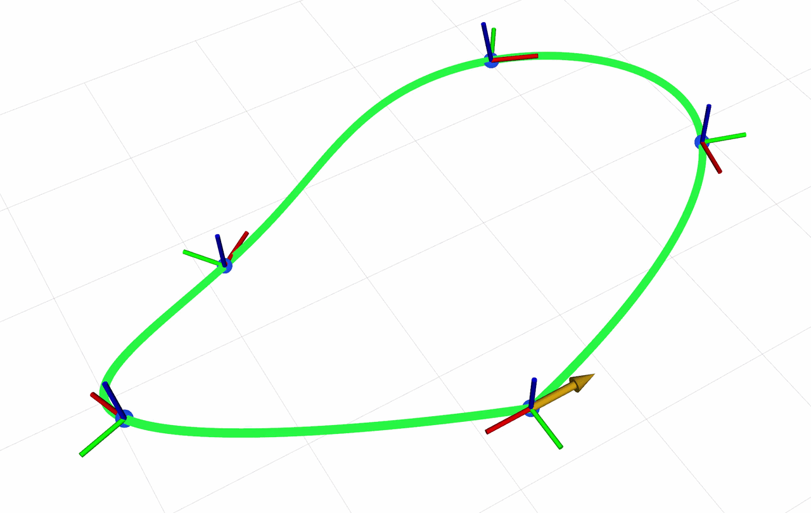

# mono_planner
Motion planner for monolithic (rigid-body) robots. Plans from point cloud input.

## 1. Dependencies

```
sudo apt install ros-one-octomap* # change the ROS version according to your system
pip install octomap-python
```

If you encounter an error while installing octomap-python, run the following command instead:

```
CXXFLAGS="-std=c++11" pip install octomap-python
```

If problem still exists, refer to https://github.com/wkentaro/octomap-python for more solutions.

If it reports missing `libdynamicedt3d.so.1.8` while running, add the following line to `.bashrc`:

```
export LD_LIBRARY_PATH=~/.local/lib:$LD_LIBRARY_PATH
```

## 2. Waypoint Planners

This section groups the planners into two categories:

- Single-Waypoint Planner: a standalone roundtrip demo through one waypoint.
- Multiple-Waypoint Planners: two variants started from `waypoint_conditioned_planner.launch`.

### 2.1. Shared Setup

Publish the current root tail pose:

```bash
rostopic pub -r 10 dragon/root/tail_pose geometry_msgs/PoseStamped "header:
  seq: 0
  stamp:
    secs: 0
    nsecs: 0
  frame_id: 'world'
pose:
  position:
    x: 0.0
    y: 0.0
    z: 1.0
  orientation:
    x: 0.0
    y: 0.0
    z: 0.0
    w: 1.0"
```

### 2.2. Shared Topics and Outputs

Both planner categories share the same high-level ROS contract:

- Input: `root/tail_pose` (`geometry_msgs/PoseStamped`) plus waypoint pose topics.
- Output: `root/target_pose` (`geometry_msgs/PoseStamped`).
- Visualization: `mono_planner/traj_marker` (`visualization_msgs/MarkerArray`).

The exact waypoint topic pattern and startup flow depend on the planner category.

### 2.3. Single-Waypoint Planner

`single_wpt_planner.py` is a standalone single-shot planner. It waits for one `root/tail_pose` and one `/waypoint/pose_0`, freezes that pair as a planning snapshot, and constructs a single 3D circle for the trajectory `root -> waypoint_0 -> root`.

Prepare the waypoint input with the dedicated single-waypoint config:

```bash
roslaunch mono_planner waypoint_pose_publisher.launch config_file:=config/single_waypoint.yaml
```

Then launch the planner:

```bash
roslaunch mono_planner single_wpt_planner.launch
```

### 2.4. Multiple-Waypoint Planners

These planners run through `waypoint_conditioned_planner.launch`. They discover `waypoint/pose_x` topics automatically, use the first received `root/tail_pose` as the default fixed return pose, and by default freeze the first planning input set that produces a successful plan. Set `goal_pose:=/goal_pose` to use a published `geometry_msgs/PoseStamped` as the terminal pose instead. In the default `replan:=false` mode, later `goal_pose`, `waypoint/pose_x`, and waypoint topic-set changes are ignored. Set `replan:=true` to replan from the latest `root/tail_pose` when those inputs change.

Prepare waypoint input with the default waypoint publisher configuration:

```bash
roslaunch mono_planner waypoint_pose_publisher.launch
```

#### 2.4.1. Holonomic Planner

The holonomic variant is intended for rigid-body robots that can track arbitrary pose trajectories. It plans the sequence `current root -> waypoint_0 -> waypoint_1 -> ... -> terminal pose` without requiring the published orientation to follow the trajectory tangent.

Launch it with:

```bash
roslaunch mono_planner waypoint_conditioned_planner.launch robot_frame_type:=LINK
```

To keep replanning whenever waypoint poses or the waypoint topic set changes:

```bash
roslaunch mono_planner waypoint_conditioned_planner.launch robot_frame_type:=LINK replan:=true
```

Holonomic planner demo (video speed: 2x):



#### 2.4.2. Nonholonomic Planner

The nonholonomic variant keeps the same launch entry point and waypoint flow, but constrains the published `root/target_pose` orientation so that the robot body `X` axis follows the local motion direction.

Launch it with:

```bash
roslaunch mono_planner waypoint_conditioned_planner.launch nonholo:=true robot_frame_type:=LINK
```

To keep replanning whenever waypoint poses or the waypoint topic set changes:

```bash
roslaunch mono_planner waypoint_conditioned_planner.launch nonholo:=true robot_frame_type:=LINK replan:=true
```
